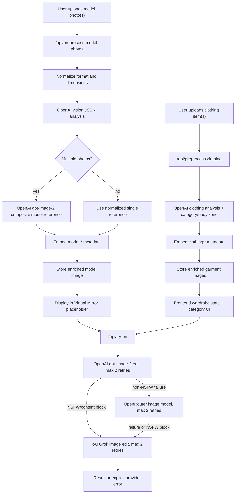

# Virtual Try-On Pipeline

## Research Summary

| Provider | Current model name | API endpoint | Key input constraints | NSFW policy | Source URL |
| --- | --- | --- | --- | --- | --- |
| OpenAI | `gpt-image-2` for image generation/editing; `gpt-5-mini` default for model-photo and clothing vision analysis | `POST https://api.openai.com/v1/images/edits`; `POST https://api.openai.com/v1/chat/completions` for vision JSON | Use multipart `image[]` inputs for edits; prompt should label each image by index; use explicit preserve/change constraints; `quality=high`, output `jpeg` by default for try-on photos. If the newest image model is unavailable on the deployed account, the backend stays inside OpenAI first and tries `gpt-image-1.5`, `gpt-image-1`, then `gpt-image-1-mini` before provider fallback. | Image/content safety blocks are detected from `image_safety`, `content policy`, `sexual`, `nudity`, `prohibited_content`, etc. NSFW-specific failures route to xAI/Grok rather than OpenRouter. | https://developers.openai.com/cookbook/examples/multimodal/image-gen-models-prompting-guide and https://developers.openai.com/api/docs/guides/image-generation |
| OpenRouter | `google/gemini-3.1-flash-image-preview` by default; override via `OPENROUTER_TRYON_IMAGE_MODEL` | `POST https://openrouter.ai/api/v1/chat/completions` | Chat Completions payload with image URL/data URL content parts, `modalities: ["image", "text"]`, `image_config` aspect ratio/size hints | Any OpenRouter safety/NSFW block routes to xAI/Grok. Other OpenRouter failures retry twice, then route to xAI/Grok. | https://openrouter.ai/docs/guides/overview/multimodal/image-generation |
| xAI | `grok-imagine-image-quality` by default; override via `XAI_TRYON_IMAGE_MODEL` | `POST https://api.x.ai/v1/images/edits` | First image is the processed model reference; remaining images are garments. More than two garments are packed into a garment reference sheet for edit compatibility. | Final provider. Failures surface explicit provider/model/status details to the user; no silent fallback remains. | https://docs.x.ai/developers/model-capabilities/images/generation and https://docs.x.ai/developers/model-capabilities/images/multi-image-editing |

Optimal normalized format used by this implementation: JPEG for model photos and non-transparent garment photos, PNG only when transparency must be preserved. The try-on result defaults to JPEG (`OPENAI_TRYON_OUTPUT_FORMAT=jpeg`) to avoid unnecessary PNG payload size for photographic output.

## Architecture Diagram



## Type Definitions

```ts
export interface ModelImageMetadata {
  "model:bodyPose": string;
  "model:skinTone": string;
  "model:approximateMeasurements": Record<string, string>;
  "model:proportions": string | Record<string, unknown>;
  "model:lightingCondition": string;
  "model:backgroundType": string;
  "model:analysisVersion": string;
  "model:analysedAt": string;
  "model:imageRole": "single" | "composite" | string;
  "model:sourcePhotoCount": number;
}

export interface ClothingMetadata {
  "clothing:category": "top" | "bottom" | "dress" | "outerwear" | "footwear" | "accessory" | string;
  "clothing:bodyZone": "upper_body" | "lower_body" | "full_body" | "feet" | "accessories" | string;
  "clothing:colours": string | string[];
  "clothing:pattern": string;
  "clothing:fitType": "loose" | "fitted" | "tailored" | "regular" | string;
  "clothing:analysisVersion": string;
  "clothing:analysedAt": string;
}

export interface TryOnRequest {
  modelImage: File | Blob | string;
  modelMetadata?: ModelImageMetadata;
  clothingItems: Array<{
    image: File | Blob | string;
    metadata?: ClothingMetadata & Record<string, unknown>;
  }>;
  category?: string;
  promptMetadata?: Record<string, unknown>;
}

export interface TryOnResult {
  image_url: string;
  retry_info: Array<{
    attempt: number;
    provider?: "openai" | "openrouter" | "xai";
    model?: string;
    strategy: string;
    reason: string;
    modificationsSummary?: string;
  }>;
  modesty_applied: boolean;
}
```

## Backend Code

Implemented in the actual repo stack:

- `backend/services/model_photo_processor.py`: model upload normalization, OpenAI vision analysis, multi-photo composite generation, model metadata embedding, storage.
- `backend/services/image_metadata.py`: shared EXIF/text/XMP-style metadata embedding and byte-level metadata reads.
- `backend/services/analyze_clothing.py`: now embeds required `clothing:*` metadata keys through the shared metadata helper.
- `backend/services/vton.py`: provider waterfall with OpenAI -> OpenRouter -> xAI/Grok, max two retries per provider, NSFW-specific xAI routing.
- `backend/main.py`: new `POST /api/preprocess-model-photos`, accepts `model_metadata` in `POST /api/try-on`.

## Frontend Integration Notes

- `frontend/app/page.tsx` now calls `/api/preprocess-model-photos` when model photos are selected or reordered.
- The processed model image is displayed as the Virtual Mirror placeholder before generation.
- When the try-on request starts, the frontend fetches the processed model/composite image and sends that as the `user_image`/`user_images` input.
- `model_metadata` is appended to the try-on form and merged into backend prompt enrichment.
- The Try On button is disabled while model-photo analysis is running or failed, so the pipeline cannot silently skip metadata enrichment.
- Clothing upload already goes through `/api/preprocess-clothing`; the response category/body-region metadata remains surfaced in the wardrobe UI.

## Error Handling Reference

| Provider | Expected error signal | Handling |
| --- | --- | --- |
| OpenAI | `429`, `insufficient_quota`, billing/credit messages | Skip remaining OpenAI attempts and call OpenRouter. |
| OpenAI | `400/403/422` with `nsfw`, `sexual`, `nudity`, `image_safety`, `prohibited_content`, `content policy` | Retry within OpenAI budget, then route directly to xAI/Grok. |
| OpenAI | Timeout/network/5xx/non-NSFW failure | Retry twice with exponential backoff, then call OpenRouter. |
| OpenRouter | Non-2xx response without NSFW keywords | Retry twice with exponential backoff, then call xAI/Grok. |
| OpenRouter | NSFW/content-safety keywords | Route to xAI/Grok with a general-audience fallback contract. |
| xAI | Non-2xx, no image in response, timeout | Retry twice with exponential backoff, then surface explicit `xAI/Grok try-on fallback failed: ...` error. |
